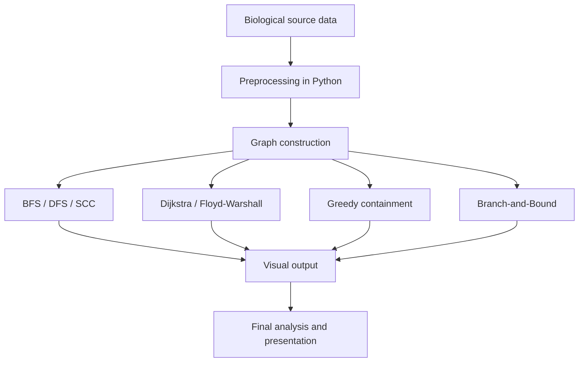

<div align="center">

<h1>🧬 TraceNet</h1>

<h3><strong>T</strong>racking <strong>R</strong>esistance <strong>A</strong>cross <strong>C</strong>linical <strong>E</strong>cosystems with <strong>N</strong>etworks</h3>

<p><em>A graph-theoretic DAA project for modeling, tracing, and analyzing antibiotic resistance spread through bacterial transmission networks.</em></p>

[](https://isocpp.org/)
[](https://python.org)
[](#overview)
[](#overview)
[](#roadmap)

<br/>

[**Overview**](#overview) · [**Why TraceNet**](#why-tracenet) · [**Model**](#graph-model) · [**Algorithms**](#algorithm-map) · [**Experiments**](#experiments) · [**Run**](#running-tracenet)

</div>

---

## Overview

TraceNet is a **graph algorithms project for antibiotic resistance spread analysis**. It models bacterial strains, resistance genes, and transfer relationships as a weighted directed graph, then applies classical DAA techniques to study how resistance propagates, where it concentrates, and which transmission paths are most critical.

Most student graph projects stop at shortest paths in cities or friend recommendations. TraceNet asks a more interesting question:

> **If resistance genes move through bacterial networks like information flows through a graph, which paths matter most, which communities are most vulnerable, and where should containment begin?**

The project is intentionally designed to feel like a real systems problem while staying fully within the scope of a DAA course. It combines:
- graph construction from curated biological data,
- traversal and connectivity analysis,
- shortest-path and all-pairs path analysis,
- topological reasoning on gene dependencies,
- greedy containment heuristics,
- and branch-and-bound for small subproblems.

TraceNet is not a medical diagnostic tool. It is an **algorithmic model** for studying spread and containment in a resistance network.

---

## Why TraceNet

Antibiotic resistance is a real-world network problem.

Bacteria do not spread resistance in isolation. Genes move through plasmids, mobile elements, and shared ecological pressure, creating a transmission network that is naturally graph-shaped. That makes this topic a strong fit for DAA because the core questions are algorithmic:

- What is reachable from a source strain?
- Which strains form strongly connected communities?
- What is the shortest or most probable spread path?
- Which transfer routes are most critical?
- What happens when we remove key edges?

TraceNet was built around that idea: **take a high-impact biological problem and solve it using classical graph algorithms that can be explained, implemented, visualized, and defended in a lab viva**.

---

## Graph Model

TraceNet models the system as a weighted directed graph \(G = (V, E)\).

### Nodes

Nodes represent:
- bacterial species,
- bacterial strains,
- or clinically relevant reservoirs.

Examples:
- *Escherichia coli*
- *Klebsiella pneumoniae*
- *Acinetobacter baumannii*
- environmental or livestock-linked reservoirs

### Edges

Directed edges represent possible or documented resistance transfer relationships.

Each edge may carry:
- **direction**: donor → recipient,
- **weight**: transfer likelihood / similarity / risk score,
- **label**: resistance gene family or ARG cluster.

### Edge meaning

An edge does not claim a literal observed transfer in every case. In the project, an edge is interpreted as a **modeled transmission relationship** based on curated or derived data.

That distinction matters. It keeps the project honest and makes the analysis defensible.

---

## Data Pipeline

TraceNet uses a preprocessing layer to convert biological source data into graph input for C++ algorithms.

### Input sources

The project can work with:
- curated ARG prevalence tables,
- resistance gene family mappings,
- species-by-gene co-occurrence matrices,
- or small preprocessed supplementary datasets.

### Preprocessing steps

1. Read the biological dataset.
2. Filter relevant species / ARGs.
3. Build species-to-ARG sets.
4. Estimate similarity or transfer likelihood.
5. Emit a compact adjacency file.
6. Feed that file into the C++ graph engine.

### Example output format

```text
<number_of_nodes>
<number_of_edges>
species_1
species_2
species_3
...
u v weight label
u v weight label
```

This separation keeps the implementation clean:
- Python handles data shaping.
- C++ handles graph algorithms.

That is a good engineering design choice for a course project.

---

## Algorithm Map

TraceNet is designed to cover multiple units of the DAA syllabus in one coherent pipeline.

| Question | Algorithm | Syllabus Unit | Role in TraceNet |
|---|---|---:|---|
| Which strains are connected through resistance spread? | BFS / DFS | Unit II | Graph traversal and reachability |
| Which bacterial communities are tightly linked? | SCC (Kosaraju / Tarjan) | Unit II | Resistance cluster detection |
| What is the spread order among gene dependencies? | Topological Sort | Unit II | Gene acquisition ordering |
| Find ARG sequence matches in reference data | Boyer-Moore / Horspool | Unit III | Pattern search on gene strings |
| What is the spread distance between every pair? | Floyd-Warshall | Unit IV | All-pairs path analysis |
| What is the most likely spread route to a clinical target? | Dijkstra | Unit IV | Shortest / highest-risk path |
| Which key edges should be removed first? | Greedy heuristic | Unit IV | Containment approximation |
| What is the optimal containment for a small graph? | Branch-and-Bound | Unit V | Exact search on reduced subgraph |
| Is the problem hard in general? | NP-hardness discussion | Unit V | Complexity framing |

This mapping is one of the strongest parts of the project: it is not “algorithm dumping.” Every method has a specific analytical purpose.

---

## Core Ideas

TraceNet explores four main questions.

### 1. Reachability
If resistance starts in one reservoir, where can it go?

This is handled using BFS and DFS. It gives the most basic spread analysis and is useful for tracing connected regions.

### 2. Community structure
Which organisms form closed resistance-sharing loops?

This is handled using strongly connected components. SCCs are useful because they reveal cycles where resistance may circulate repeatedly.

### 3. Path risk
What is the most critical route from reservoir to pathogen?

This is handled using Dijkstra and Floyd-Warshall. The goal is to compare single-source and all-pairs perspectives.

### 4. Containment
If we cannot stop everything, what should we target first?

This is handled using greedy edge selection and branch-and-bound on smaller graphs. The project frames containment as an optimization problem rather than a purely descriptive one.

---

## Algorithms

### BFS / DFS

Used for:
- reachability checks,
- traversal of the resistance graph,
- connected subgraph discovery,
- and base-level visualization.

### SCC

Used for:
- identifying resistance “bubbles”,
- finding tightly coupled communities,
- and understanding cyclic spread.

### Topological Sort

Used for:
- dependency-style gene ordering,
- simplified acquisition constraints,
- and DAG-based reasoning on gene progression.

### Boyer-Moore

Used for:
- fast pattern matching in ARG reference strings,
- locating known gene signatures,
- and demonstrating space-time trade-offs.

### Floyd-Warshall

Used for:
- all-pairs spread distance,
- vulnerability matrix generation,
- and dense small-graph analysis.

### Dijkstra

Used for:
- shortest or lowest-cost spread path,
- source-to-target route analysis,
- and risk tracing.

### Greedy Containment

Used for:
- ranking edges by importance,
- approximate intervention selection,
- and low-cost blocking heuristics.

### Branch-and-Bound

Used for:
- exact containment on small subgraphs,
- controlled exhaustive search,
- and comparison against greedy.

---

## Experiments

TraceNet is designed to produce measurable outputs rather than just code.

### Experiment 1 — Reachability
Measure how many nodes are reachable from a source strain under BFS and DFS.

### Experiment 2 — Community Detection
Compare SCC results across different subgraphs and identify dense resistance clusters.

### Experiment 3 — Path Risk
Use Dijkstra to identify the most likely spread path from an environmental reservoir to a clinical pathogen.

### Experiment 4 — All-Pairs Vulnerability
Use Floyd-Warshall to generate a spread-distance matrix and identify high-risk pairs.

### Experiment 5 — Containment Comparison
Compare:
- greedy edge removal,
- and exact branch-and-bound on a small graph.

### Experiment 6 — String Matching
Use Boyer-Moore on known resistance gene patterns and compare runtime against naive search.

---

## Research Contributions

TraceNet is a course project, not a research paper, but it still has a clear technical story.

| # | Contribution | Why it matters |
|---|---|---|
| 1 | Converts resistance spread into a clean graph problem | Makes the biology algorithmically tractable |
| 2 | Uses multiple classical graph algorithms in one pipeline | Shows breadth and synthesis, not isolated coding |
| 3 | Separates preprocessing from core C++ logic | Makes the system modular and realistic |
| 4 | Compares reachability, shortest paths, SCCs, and containment | Supports meaningful analysis instead of one-off outputs |
| 5 | Demonstrates greedy vs exact reasoning on small graphs | Connects practical and theoretical DAA ideas |

The real contribution is not novelty in the research sense. The contribution is a **well-structured, defensible, and visually strong algorithmic system** applied to an important domain.

---

## Repository Structure

```text
TraceNet/
├── data/                  # Downloaded CARD data + generated graph files
│   ├── card_r/            # CARD-R Prevalence archive (gitignored)
│   ├── card_fasta/        # CARD Reference FASTA archive (gitignored)
│   ├── hgt_graph.txt      # Generated: 16-node HGT species graph
│   ├── arg_dag.txt        # Hand-authored: 10-node ARG dependency DAG
│   ├── arg_sequences.fasta# Filtered ARG sequences for Boyer-Moore
│   └── hospital_subgraph.txt # Reduced subgraph for branch-and-bound
├── preprocessing/         # Python pipeline: CARD-R → hgt_graph.txt
├── src/                   # C++ graph engine (one .h/.cpp per algorithm)
├── results/               # Algorithm output files (gitignored)
├── viz/                   # Graphviz DOT files + render_all.sh
├── analysis/              # Python heatmap and comparison scripts
├── tests/                 # C++ unit tests per algorithm
├── experiments/           # Experiment harnesses and results
├── docs/                  # dataset_reference.md + project specification
├── reports/               # Final lab report and presentation materials
└── README.md
```

---

## Project Flow



### Pipeline

1. Preprocess curated data into graph format.
2. Load graph into C++.
3. Run traversal and connectivity algorithms.
4. Run shortest-path and all-pairs analysis.
5. Run containment heuristics.
6. Visualize the graph and report the findings.

---

## Expected Outputs

TraceNet should generate:

- adjacency lists / matrices,
- reachability results,
- SCC clusters,
- shortest paths,
- all-pairs distance table,
- containment ranking,
- and graph visualizations.

For presentation, the most important artifacts are:
- a clean graph diagram,
- one path trace example,
- one SCC cluster figure,
- one comparison table between greedy and exact containment.

---

## Design Principles

TraceNet is built around five principles:

- **Graph-first:** the biology exists to support the graph, not the other way around.
- **Algorithmically honest:** every output is tied to a named DAA technique.
- **Modular:** preprocessing and algorithm engine are separated.
- **Visual:** results should be easy to explain in a viva.
- **Defensible:** the project should sound strong under questioning.

---

## Roadmap

- [ ] Finalize curated dataset
- [ ] Build preprocessing script
- [ ] Export graph to C++ format
- [ ] Implement BFS / DFS
- [ ] Implement SCC
- [ ] Implement Boyer-Moore pattern matching
- [ ] Implement Floyd-Warshall
- [ ] Implement Dijkstra
- [ ] Implement greedy containment
- [ ] Implement branch-and-bound on a small subgraph
- [ ] Generate Graphviz visualizations
- [ ] Write report and presentation
- [ ] Prepare viva defense notes

---

## Team

<div align="center">

| | Name | GitHub |
|---|---|---|
| 👤 | Varun Aditya | [@varunaditya27](https://github.com/varunaditya27) |
| 👤 | Tanisha R. | [@Tanisha-27-12](https://github.com/Tanisha-27-12) |

*2nd Year B.E. Information Science Engineering · RVCE Bengaluru*

</div>

---

## Running TraceNet

### 1. Clone the repository

```bash
git clone https://github.com/varunaditya27/TraceNet.git
cd TraceNet
```

### 2. Install Python dependencies

```bash
pip install -r requirements.txt
```

### 3. Download CARD datasets

```bash
mkdir -p data/card_r data/card_fasta
wget https://card.mcmaster.ca/latest/variants -O data/card_variants.tar.bz2
wget https://card.mcmaster.ca/latest/data    -O data/card_data.tar.bz2
tar -xjf data/card_variants.tar.bz2 -C data/card_r/
tar -xjf data/card_data.tar.bz2    -C data/card_fasta/
```

### 4. Build graph and compile

```bash
python preprocessing/build_graph.py        # generates data/hgt_graph.txt (16 nodes, ~144 edges)
make                                        # compiles all C++ sources into ./tracenet
```

Direct compilation without Make:
```bash
g++ -std=c++17 -Wall -Wextra src/main.cpp src/graph.cpp src/utils.cpp src/bfs.cpp \
    src/dfs.cpp src/scc_kosaraju.cpp src/topo_sort.cpp src/boyer_moore.cpp \
    src/dijkstra.cpp src/floyd_warshall.cpp src/greedy_contain.cpp \
    src/bnb_contain.cpp -o tracenet
```

### 5. Run the project

```bash
./tracenet data/hgt_graph.txt
```

---

## Demo Plan

A good demo for TraceNet should show:

1. Input graph creation.
2. BFS/DFS traversal.
3. SCC detection.
4. Dijkstra path trace.
5. Floyd-Warshall matrix output.
6. Greedy containment ranking.
7. Branch-and-bound on a small graph.
8. Final visualization.

That sequence tells a coherent story from graph construction to decision support.

---

## Limitations

TraceNet is deliberately scoped as a **course project**.

It does not claim:
- to infer all real-world HGT events exactly,
- to replace bioinformatics tools,
- or to provide medical conclusions.

Instead, it aims to:
- show how DAA maps cleanly onto a meaningful domain,
- demonstrate algorithmic analysis,
- and produce a strong, visual, viva-ready project.

That honesty actually makes the project stronger.

---

## Closing Note

TraceNet is an algorithmic study of how resistance moves, clusters, and can be traced through networks.

It is simple enough to build as a student project, but rich enough to look serious in front of a professor.

<div align="center">

**[⬆ Back to top](#-tracenet)**

*TraceNet — graph algorithms for tracing resistance spread.*

</div>
